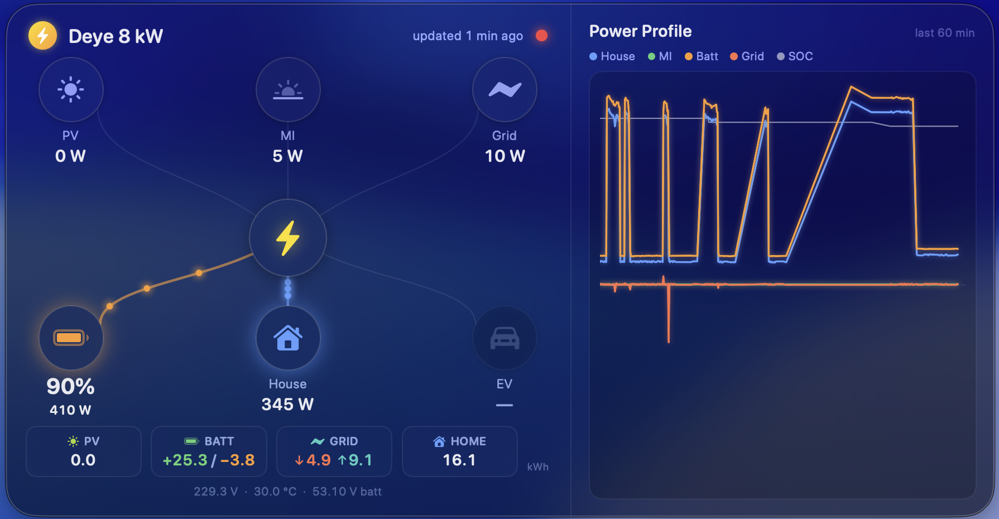

# DeyeWidget — live macOS desktop widget for Deye hybrid inverters

A native macOS desktop widget that shows a **live power-flow graph** and a **rolling 60-minute power-history chart** for a Deye / Sunsynk single-phase hybrid inverter — read directly from the inverter's Solarman LSW logger over your LAN. No cloud, no Python, no account.



## Features

- **Local only** — talks to the Solarman LSW logger on your LAN via the Solarman V5 protocol over TCP (Modbus RTU inside). No DeyeCloud, no internet round-trip.
- **Live flow graph** — six nodes (PV, MI/AC-coupled PV, Grid, Battery, House, EV placeholder) around a central inverter, with animated energy dots that follow the true power direction. Polls every 5 s.
- **Power Profile chart** — a rolling 60-minute history of House / MI / Battery / Grid watts plus battery SOC, drawn in the same aesthetic.
- **Menu bar item** — battery SOC at a glance (`⚡ 90%`), plus a snapshot menu (load / PV+MI / grid / battery).
- **Size presets** — Small / Medium / Large, everything scales crisply (not rasterized).
- **Chart toggle** — show/hide the chart pane; the window collapses to just the flow graph.
- **Desktop-level widget** — borderless, translucent, rounded card that floats above the wallpaper and desktop widgets but under your app windows. Drag it anywhere; position is remembered.

## Requirements

- macOS 13 or later.
- A Deye / Sunsynk **single-phase LP1-family hybrid inverter** with a **Solarman LSW-series Wi-Fi/LAN logger** ("stick") on the same network. The register map used here is the Sunsynk/Deye single-phase LP1 layout (Sunsynk-compatible) — other inverter families may need a different map.
- Swift toolchain (Xcode 15+ or the Swift 5.9+ command-line tools). No Xcode project — pure Swift Package Manager.

## Build

```sh
git clone https://github.com/Chocksy/deye-widget.git
cd deye-widget
swift build -c release
```

The app binary is at `.build/release/DeyeWidget`.

Quick protocol sanity check without the GUI (prints all mapped values once and exits):

```sh
.build/release/DeyeWidget --dump
```

Launch the widget:

```sh
.build/release/DeyeWidget &
```

It runs as a menu-bar accessory (no Dock icon). Quit from the menu-bar item.

## Configuration

Until you provide a **host** and **logger serial**, the widget stays idle and shows "not configured". Two ways to set them:

**1. Settings… (menu bar → Settings…)** — a small form for host/IP, port, logger serial, Modbus slave id, and poll interval.

**2. `defaults` (same values, from the terminal):**

```sh
defaults write DeyeWidget host 192.168.1.100      # your logger's LAN IP
defaults write DeyeWidget loggerSerial 1234567890 # the serial printed on the stick
defaults write DeyeWidget port 8899               # default Solarman port
defaults write DeyeWidget slaveId 1               # inverter Modbus slave id
```

Finding the values:

- **Logger IP** — check your router's DHCP client list for the Solarman/LSW device, or scan port `8899` on your subnet (`nmap -p8899 192.168.1.0/24`). A static DHCP lease is recommended so it doesn't move.
- **Logger serial** — the 9–10 digit number printed on a label on the logger stick (it is the *logger* serial, not the inverter SN).

## How it works

Each poll opens (or reuses) one TCP connection to the logger on port 8899 and issues two Modbus **read holding registers** requests (function `0x03`), wrapped in Solarman V5 frames:

```
A5 <len u16 LE> <control 0x4510 LE> <seq u16 LE> <loggerSerial u32 LE>
   <payload: frameType(0x02) sensorType deliveryTime powerOnTime offsetTime + modbusRTU>
   <checksum u8> 15
```

The response (control `0x1510`) carries the Modbus RTU answer starting at byte offset 25; both the V5 checksum and the Modbus CRC-16 (poly `0xA001`) are verified before the u16-big-endian registers are decoded. The full register map, scaling, and byte-exact framing are documented in **[docs/SPEC.md](docs/SPEC.md)**; the visual design brief is in **[docs/DESIGN.md](docs/DESIGN.md)**.

## Caveats

- **Read-only.** The client only ever issues Modbus function `0x03` (read holding registers). It never writes to the inverter.
- **History is in-memory.** The Power Profile chart's 60-minute history is not persisted — it resets when the app restarts and refills over the following hour.
- **One inverter family.** The register map targets the Deye/Sunsynk single-phase LP1 layout verified against a Deye 8 kW LP1 hybrid. Other models may report different registers/scales.

## License

MIT — see [LICENSE](LICENSE).
